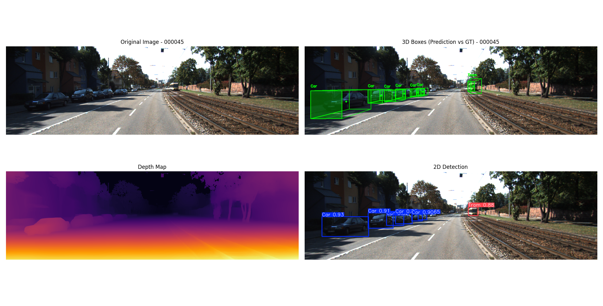
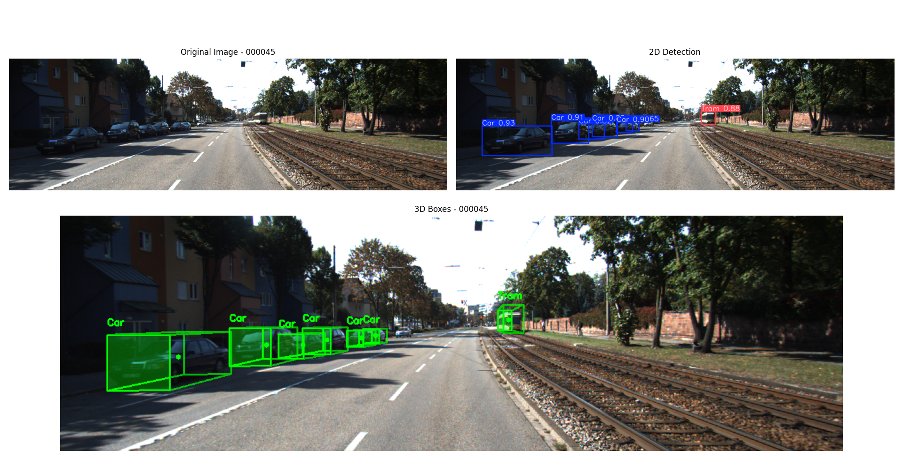

# YOLOx3D

An experimental 3D object detection system that combines YOLOv11 for object detection with Depth Anything v2 for depth estimation to detect 3D bounding boxes. This approach is inspired by the pseudo 3D object detection method of [Nicolai Høirup Nielsen](https://github.com/niconielsen32) in his project [YOLO-3D](https://github.com/niconielsen32/YOLO-3D). The orientation and dimensions of the boxes are based on the work of Arsalan Mousavian, Dragomir Anguelov, John Flynn, and Jana Kosecka in their paper ["3D Bounding Box Estimation Using Deep Learning and Geometry"](https://arxiv.org/pdf/1612.00496).

For evaluation and further improvements, this project also includes a full implementation of the aforementioned paper, including location estimation based on geometric constraints. This implementation is based on the work of [Didi Ruhyadi](https://github.com/ruhyadi) in his project [YOLO3D](https://github.com/ruhyadi/YOLO3D).

This project is mainly focused on the KITTI 3D objects dataset, but it can be adapted to other datasets with some modifications.

## How It Works

1. **Object Detection** – Identifies objects in each frame, outputting precise 2D bounding boxes.  
2. **Depth Estimation** – Produces a relative depth map, calibrated to obtain absolute depth values using the method described in this paper: [Absolute Distance Prediction Based on Deep Learning Object Detection and Monocular Depth Estimation Models](https://arxiv.org/pdf/2111.01715).  
3. **3D Localization** – Fuses the 2D bounding boxes with depth data to estimate each object’s position in 3D space.  
4. **Orientation & Size Prediction** – Regresses the object’s orientation and real-world dimensions directly from the 2D detections using a CNN.

---

## Example Outputs

**With DepthAnythingV2 (raw depth + 2D detection):**  
  
*Estimated depth maps combined with YOLOv11 object detections. No geometric refinement applied.*

---

**With geometric constraints (refined 3D bounding boxes):**  
  
*3D bounding box estimation using geometric reasoning, inspired by Mousavian et al.'s approach.*

---

## Installation & first Steps

To set up the project, follow these steps:
1. Create a virtual environment (optional but recommended)
2. Install the project & dependencies:
    ```bash
    pip install -e .
    ```
3. Download the pre-trained weights for YOLOv11 and the multibin_model, and place them in a folder `weights/` at the root of the project.
    - [YOLOv11 weights (finetunned on KITTI)](https://drive.google.com/file/d/1YmoHkc2sf-1yQaOoTufyndCIaWiF7GLK/view?usp=sharing)
    - [Multibin model weights](https://drive.google.com/file/d/1Q1eZgrd5jVXMnlenyE5spPtreLqtye6-/view?usp=sharing)
4. Run the demo on sample KITTI images included in this repository:

    - **Depth-based method:**
      ```bash
      python scripts/demo.py
      ```

    - **Geometry-based method:**
      ```bash
      python scripts/demo.py --use_geometry
      ```

    This script takes a random image from the KITTI dataset and runs inference using the pre-trained models.

**Note:** For comprehensive evaluation, you can download the full [KITTI 3D object detection dataset](https://www.cvlibs.net/datasets/kitti/eval_object.php?obj_benchmark=3d) and place it in the `KITTI_dataset/` directory.

## Evaluation

To evaluate the model on the KITTI dataset, you can use the provided evaluation script. This script will compute the 3D bounding box metrics and visualize the results. You can run with use_geometry to compare the geometry-based method with the depth-based method:
```bash
python scripts/evaluate.py (--use_geometry)
```

## Structure

The project is organized as follows:
```
YOLOx3D/
├── scripts/                # Main entry points for training, evaluation, and inference
│   ├── train.py            # Training script for the regressor  (Multi-bin regression)
│   ├── evaluate.py         # Evaluation script for 3D object detection
│   └── demo.py             # Demo script for running inference on sample images
│   └── calibrate_depth.py  # Calibrate relative depth to absolute depth with KITTI dataset
├── src/
│   ├── config/             # Configuration files and path utilities
│   ├── data/               # Dataset loaders and preprocessing
│   ├── models/             # Model architectures and loss functions
│   ├── pipeline/           # Inference pipelines for geometry and depth-based methods
│   ├── utils/              # Utility modules for KITTI, evaluation, and calibration
│   │   ├── kitti_utils.py  # KITTI dataset utilities
│   │   ├── class_dimensions.py  # Average class dimensions for 3D bounding boxes
│   │   ├── evaluation.py   # Evaluation metrics and functions
│   │   ├── depth_calibration.py  # Depth calibration
│   │   ├── bbox3d_estimators.py  # 3D bounding box estimators (used in pipeline)
│   │   └── ...
│   └── ...
├── config/                 # Configuration files used in the scripts to set paths and parameters
├── calibration/            # Precomputed calibration and class dimension files (For KITTI dataset)
├── weights/                # Saved model weights and checkpoints
├── KITTI_dataset/          # Sample KITTI dataset files
├── runs/                   # TensorBoard logs
└── ...
```

## Acknowledgments

- [YOLOv11](https://github.com/ultralytics/ultralytics) by Ultralytics
- [Depth Anything v2](https://github.com/DepthAnything/Depth-Anything-V2)
- [KITTI Dataset](http://www.cvlibs.net/datasets/kitti/eval_object.php?obj_benchmark=3d)
- [YOLO-3D](https://github.com/niconielsen32/YOLO-3D) by Nicolai Høirup Nielsen
- [YOLO3D](https://github.com/ruhyadi/YOLO3D) by Didi Ruhyadi
- [3D Bounding Box Estimation Using Deep Learning and Geometry](https://arxiv.org/pdf/1612.00496) by Arsalan Mousavian, Dragomir Anguelov, John Flynn, and Jana Kosecka
- [Absolute Distance Prediction Based on Deep Learning Object Detection and Monocular Depth Estimation Models](https://arxiv.org/pdf/2111.01715) by Armin MASOUMIAN, David G. F. MAREI, Saddam ABDULWAHAB, Julián CRISTIANO, Domenec PUIG and Hatem A. RASHWAN.
