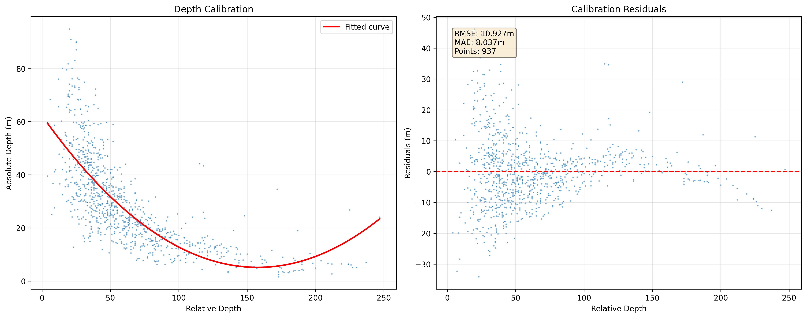
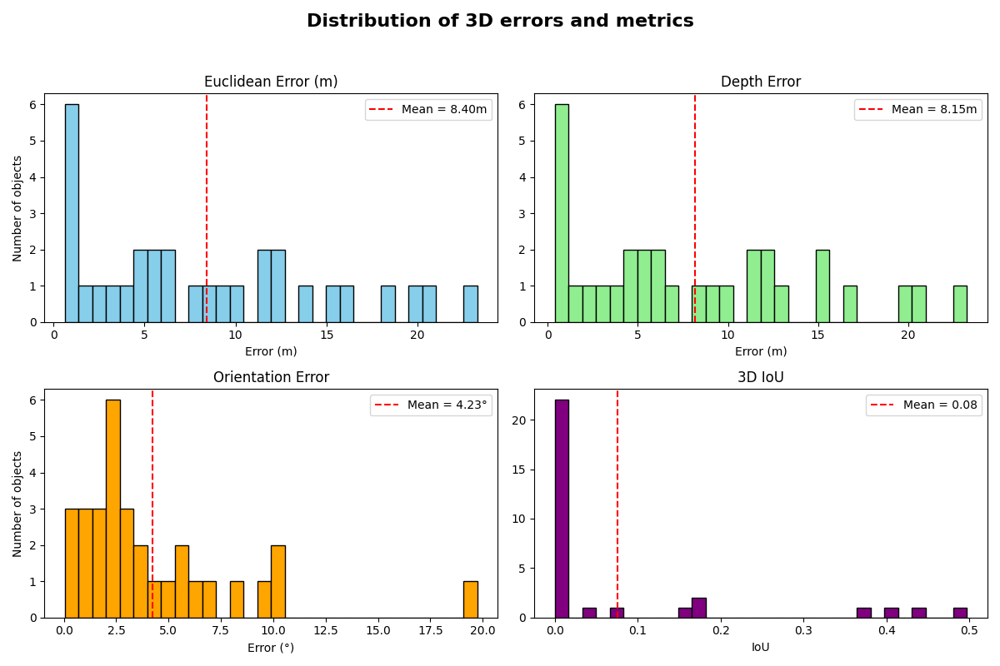
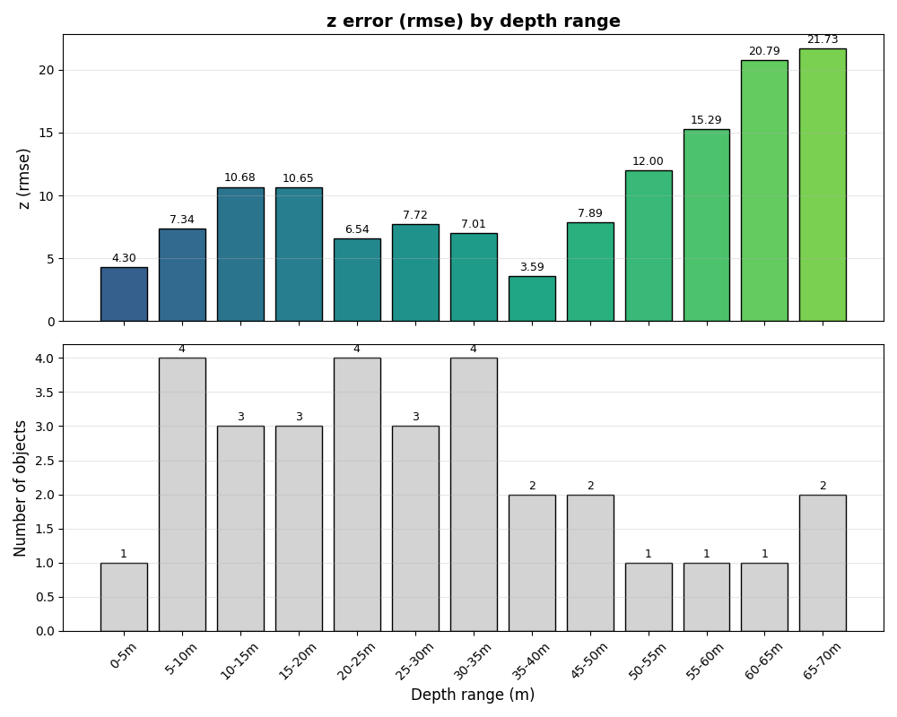
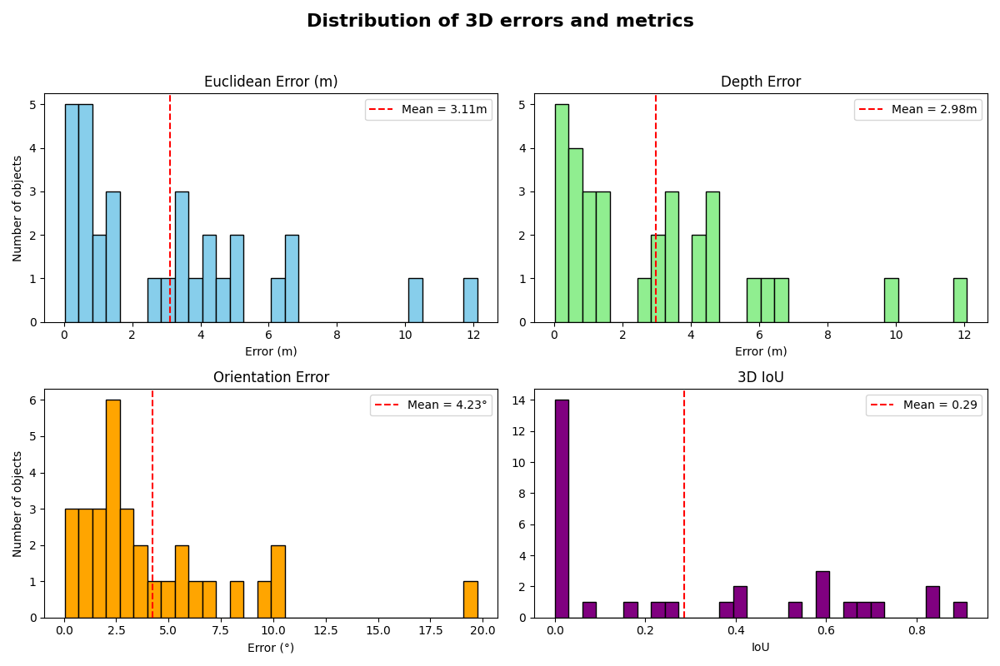
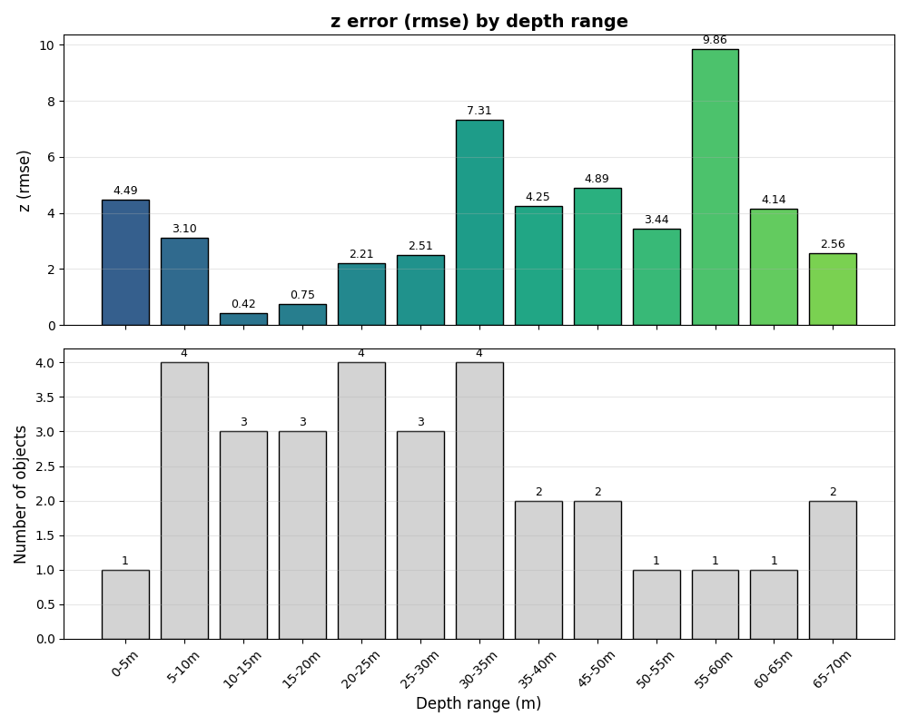

# Monocular 3D Object Detection – Depth-Based vs. Geometric Method

This document compares two approaches for monocular 3D object detection:

1. **Depth Estimation–Based Method**  
   Uses monocular depth estimation (calibrated to absolute depth) to localize objects, combined with CNN-based orientation and dimension regression.

2. **Geometric–Based Method**  
   Uses the same CNN for orientation and dimension regression, but computes location geometrically as in  
   *3D Bounding Box Estimation Using Deep Learning and Geometry*.

---

## 1. Evaluation Metrics

### Depth-Based Method

```
=== Evaluation Summary ===
average_iou_2d: 0.9319
average_iou_3d: 0.0710
average_orientation_error: 0.0520
depth_rmse: 7.7912
delta1: 0.2857
delta2: 1.0000
delta3: 1.0000
precision_3d: 0.0000
recall_3d: 0.0000
Average processing time per image: 0.679 seconds
```

### Geometric-Based Method

```
=== Evaluation Summary ===
average_iou_2d: 0.9319
average_iou_3d: 0.4130
average_orientation_error: 0.0520
depth_rmse: 3.0784
delta1: 0.8571
delta2: 0.8571
delta3: 0.8571
precision_3d: 0.4286
recall_3d: 0.6000
Average processing time per image: 0.211 seconds
```

## 2. Evaluation graphs

### Depth-Based Method







### Geometric-Based Method





## 3. Discussion

The primary issue with the depth-based method lies in the inaccuracy of depth estimation, which is insufficient for reliable 3D localization.
Although we calibrate on KITTI 3D objects using the median depth, the conversion from relative to absolute depth tries its best with widely scattered points due to the inaccuracies in object-level depth estimation.

This dispersion leads to a very low 3D IoU and zero precision/recall, confirming that the depth-based method consistently fails to localize objects correctly in 3D space.

In addition, the processing time is significantly higher than that of the geometric-based method. This was expected, since the pipeline runs three models sequentially, but it makes the approach unsuitable for real-time applications.

## 4. Conclusion

This method is not reliable as it is now. But, if someone can improve the object depth estimation, it could be a viable option for monocular 3D object detection.